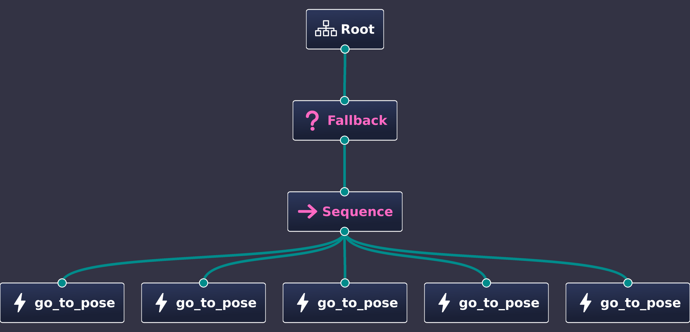

# Final-Exam-RE-703-BT-Gazebo-Sim
• Markus Pardede / 4222201063

• Bela Lisfatia / 4222201064

## Case Study
A robot with two differential wheels on the right and left sides moves from one position to another in a forward or backward motion. This is simulated through a gazebo using a behavior tree algorithm.

## Behaviour Tree Diagram


## Running Instruction
### 1. Open Terminal
To run the robot simulation in the gazebo, run the following commands:
```bash
cd ~/gazebo_ws
source ~/gazebo_ws/install/setup.bash
source /opt/ros/humble/setup.bash
ros2 launch barabot launch_sim.launch.py
```

### 2. Open New Terminal
To run the behavior tree algorithm, run the following commands:
```bash
cd ~/gazebo_ws
source install/setup.bash
ros2 run barabot_bt bt_main
```

## Demonstration RObot
[](https://www.youtube.com/watch?v=5vrrORMIICo)
